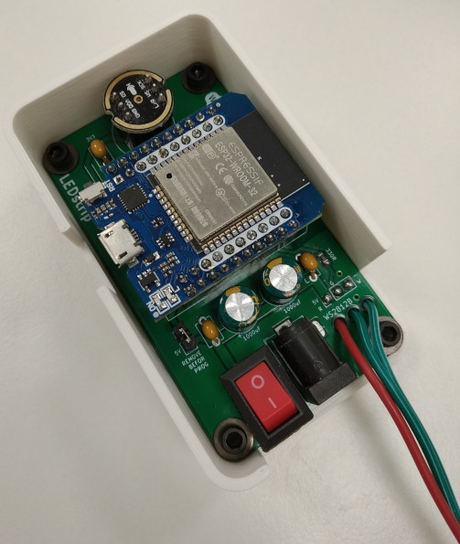
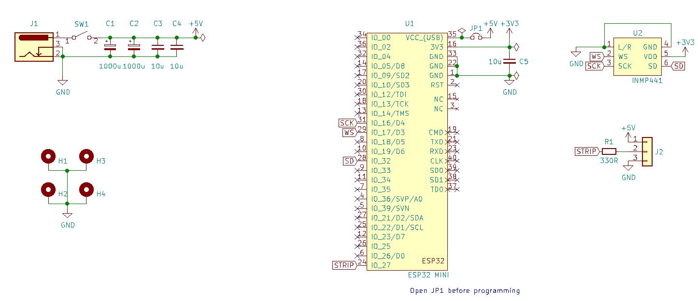
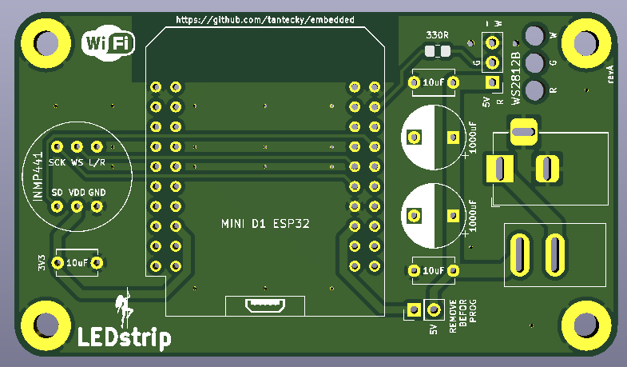

# LEDStrip

A board for controlling a WS2812B LED strip (5V). It contains ESP32 and a digital microphone INMP441.

## Content

- [PCB](!pcb/) design in KiCad
- [src/](src) an example app
- [3D printed enclosure](https://github.com/tantecky/embedded/tree/master/3Dprint/ledstrip) in FreeCAD

## Pics

