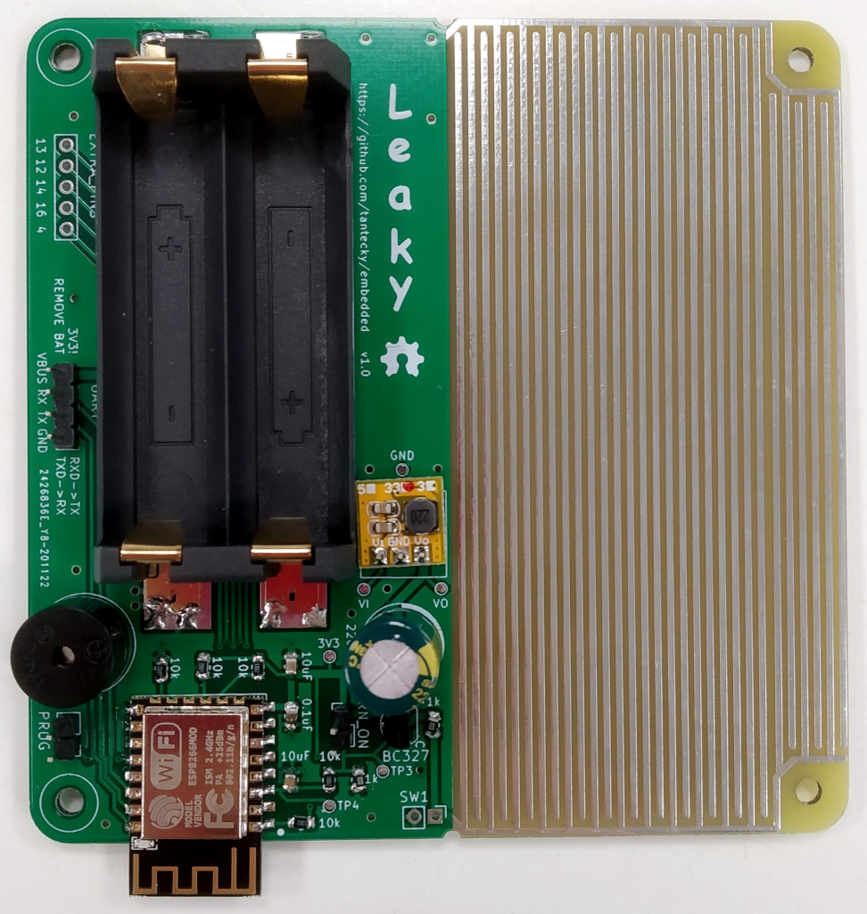

# Leaky - water detector
The repository contains a firmware example and KiCad files for open source hardware Leaky. For more info see
<a href="https://youtu.be/IXUa7aIcWfs" target="_blank">project's main page</a> and <a href="https://youtu.be/IXUa7aIcWfs" target="_blank">a short demo.</a>



## Firmware
For an example firmware see [main.cpp](src/main.cpp) and [config.cpp](src/main.cpp). When a leak is detected it starts beeping, connects to a WiFi and send a MQTT message to a given server.

To program the board an UART dongle is required (e.g. CP2102 USB 2.0 to UART). Is has to support 3V3, do not use 5V!
If you provide power through VBUS, remove batteries first.

To flash a program: 
1. Short jumper PROG
2. Connect UART (RXD->TX, TXD->RX)
3. Short jumper TURN_ON

## Home Assistant integration
Here is an example snippet for `automations.yaml` that forwards a received MQTT message and forwards it to Home Assistant mobile app:
```yaml
- id: 'Leaky'
  alias: Leak
  description: ''
  trigger:
  - platform: mqtt
    topic: leak/#
  condition: []
  action:
  - data_template:
      message: '{{ trigger.payload }}'
    service: notify.mobile_app_mi_a2_lite
  mode: single
  ```
